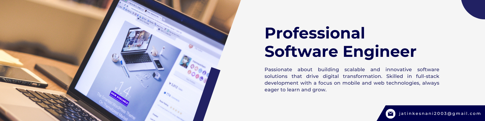

# Hi, I'm Jatin Kesnani

**Full-Stack Software Engineer | Mobile & Web Developer | Tech Enthusiast**

Welcome to my GitHub profile! I'm passionate about building scalable applications, implementing intelligent systems, and automating complex workflows. With expertise spanning full-stack development, machine learning, and DevOps, I transform ideas into impactful solutions.

---

## 🛠️ Tech Stack

### 💻 Languages

### 🎨 Frontend Development

### ⚙️ Backend Development

### 🗄️ Databases

### ☁️ DevOps & Tools

### 🤖 Machine Learning & Data Science

### 🔐 Security & Parallel Computing

---

## 💡 Areas of Expertise

- **Web Development** - Full-stack development with React, Django, and Express.js
- **Mobile Development** - React Native applications with rich user experiences
- **Machine Learning** - NLP, sarcasm detection, resume-job matching systems
- **DevOps & Orchestration** - Kubernetes, Docker, CI/CD pipelines, automation
- **Database Design** - Relational (MySQL) and NoSQL (MongoDB) database architecture
- **AI/ML Applications** - Building intelligent systems for real-world problems

---

## 📊 GitHub Statistics

---

## 📫 How to Reach Me

---

## 🤝 Let's Connect

I'm always interested in collaborating on innovative projects, discussing technology, or exploring new opportunities. Feel free to reach out!
